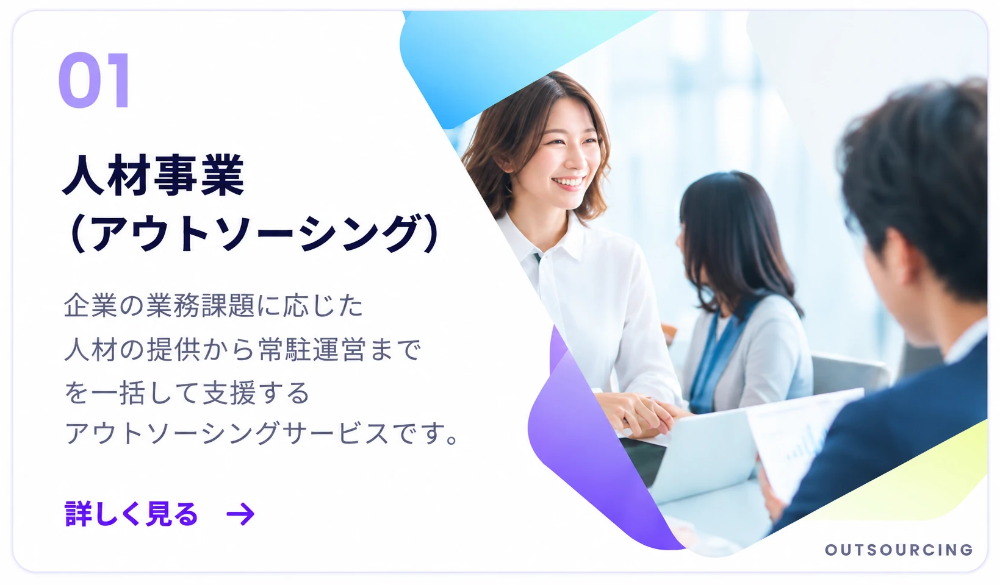

# ELEVATE サイト初期構成

添付のサイトマップに合わせた19ページの静的HTML・CSS・JavaScriptの初期セットです。ビルドは不要です。TOPのインタビューには同梱のSwiperを使用します。本文・画像・フォームの送信処理は未実装です。

## 共通ファイル

ご指定の「commn」に統一しています（「common」表記のディレクトリは作成していません）。

- `commn/css/common.css`：リセット、基本レイアウト、共通ホバー、装飾背景。
- `commn/css/site-shell.css`：全ページ共通のヘッダー／フッター、パンくずリスト、スマートフォンメニュー。
- `commn/css/experience.css`：YAOYAの余白・配置・動きを参考にした全ページ共通のレイアウト。各ページのCSSより後に読み込みます。
- `commn/js/common.js`：共通処理（年表示、固定ヘッダー、スクロール演出）。
- `commn/template.html`：新規ページ用HTMLテンプレート。

各HTMLに日本語設定・文字コード・viewport・タイトル・description・共通ヘッダー／フッター・本文領域を配置しています。ページ固有の処理がない下層ページは、空のCSS／JavaScriptを読み込みません。ヘッダー／フッターのスタイルとスマートフォンメニュー処理は共通ファイルで管理します。HTML構造を変更する場合は各ページとテンプレートに反映してください。

## URL・ファイル一覧

| ページ | URL | HTML |
| --- | --- | --- |
| TOP | `/` | `index.html` |
| サービス内容 | `/service/` | `service/index.html` |
| 総合人材派遣サービス | `/service/staffing/` | `service/staffing/index.html` |
| 人材派遣 | `/service/staffing/staffing-agency/` | `service/staffing/staffing-agency/index.html` |
| 業務請負 | `/service/staffing/contract-work/` | `service/staffing/contract-work/index.html` |
| 人材紹介 | `/service/staffing/recruitment-agency/` | `service/staffing/recruitment-agency/index.html` |
| システムエンジニアリングサービス | `/service/engineering/` | `service/engineering/index.html` |
| AI導入サービス AI-LINK | `/service/ai/` | `service/ai/index.html` |
| お仕事紹介をご希望の方 | `/introduction/` | `introduction/index.html` |
| 総合人材派遣サービス | `/introduction/staffing/` | `introduction/staffing/index.html` |
| フリーランスエンジニア ELEVATE | `https://elevate-works.jp/lp/` | 外部の既存LPへ遷移 |
| よくあるご質問 | `/introduction/faq/` | `introduction/faq/index.html` |
| 登録スタッフの方 | `/registered/` | `registered/index.html` |
| 前払い申請フォーム | `/advance-payment/` | `advance-payment/index.html` |
| 交通費申請フォーム | `/transportation-expenses/` | `transportation-expenses/index.html` |
| かんたんWeb登録 | `/web-registered/` | `web-registered/index.html` |
| 企業向けお問い合わせ | `/contact/` | `contact/index.html` |
| 会社概要 | `/company/` | `company/index.html` |
| プライバシーポリシー | `/privacy/` | `privacy/index.html` |

## ディレクトリと命名

各ページのディレクトリに `index.html` を配置しています。ページ固有のスタイルや処理が必要になった時点でCSS／JavaScriptを追加してください。TOP専用ファイルはルート直下の `css/style.css` と `js/script.js` です。

AI-LINKはサービス階層を揃え、`service/ai/index.html` としています。旧ファイルからは新しいURLへ転送します。

前払い申請・交通費申請・LPはサイトマップのURLどおりルート直下です。メニュー上の親子関係とURLのディレクトリ階層は必ずしも一致しません。

## 確認方法

`index.html` をブラウザで開くとTOPのページ一覧から全ページに移動できます。リンクはローカルで直接開ける相対パスです。

添付の `/service/` のようなURLでも確認する場合は、このフォルダで次を実行します（Python 3が必要です）。

```sh
python3 -m http.server 8000
```

ブラウザで `http://localhost:8000/` を開きます。終了は `Ctrl+C` です。

## 編集・追加方法

1. 本文を各HTMLの `<main>` 内に追加し、タイトルとdescriptionを更新します。
2. 全ページ共通のデザインは `commn/css/common.css`、個別のデザインは各ページのCSSに記述します。
3. 共通処理は `commn/js/common.js`、個別の処理が必要な場合だけページ用JSを追加します。
4. ページ追加時は `commn/template.html` をコピーします。
5. テンプレートの相対パス（共通CSS・JS、ナビゲーション）を階層に合わせて修正します。

フォームページも現時点では初期HTMLのみです。公開前に各ページの内容、正式な会社情報、入力項目・バリデーション・送信先を実装してください。

## 共通ホバーアニメーション

`commn/css/common.css` で管理します。各ページで以下のクラスを付けて使います。

```html
<!-- 画像だけを0.3秒で少し薄くする（子孫のimgが対象） -->
<a class="hover-image" href="service/index.html">
  
</a>

<!-- テキストの下線を0.3秒で左から伸ばす -->
<a class="hover-underline" href="company/index.html">会社情報</a>
```

画像単体には `` と指定できます。
時間は `--hover-duration`（初期値 `0.3s`）、画像の透明度は `--hover-image-opacity`（初期値 `0.75`）で調整できます。
キーボードのフォーカス時にも適用します。タッチ操作ではホバーを適用せず、動きを減らす設定ではアニメーションを省略します。

ヘッダー・フッターのボタンや文字ロゴには `hover-fade` を使用します。
矢印を除き文字だけに下線を付ける場合は、リンクに `hover-trigger`、文字を囲む `span` に `hover-underline` を付けます。

## 共通レイアウト・ページ表示の動き

参考サイト：https://yaoya.io/

- セクション間の余白を広げ、見出し、角丸パネル、カードの間隔を共通化しています。サービス一覧はPCで2列、スマートフォンで1列です。会社情報・FAQ・プライバシーポリシーは読みやすい幅に絞り、フォームは中央の1列構成にしています。
- アニメーション対象は描画前から非表示にし、ページ遷移やTOPのオープニング終了後に表示します。本文は下から42px（スマートフォンは24px）移動しながら約0.82秒でフェードインします。複数要素は最大0.21秒ずつ開始をずらします。
- カード、フォーム、FAQなどはまとまりで動かし、親子のアニメーションが重ならないようにしています。`data-reveal="left"` / `"right"` で横方向も指定できます。キーボードで対象内にフォーカスした場合はすぐ表示します。
- 内部ページへの移動は約0.18秒でフェードアウトし、移動先を約0.35秒でフェードインします。同一ページのアンカー・外部リンク・別タブ・修飾キー操作は通常のリンクとして動きます。`data-no-transition` で個別に遷移演出を無効化できます。
- カードはマウスホバーでわずかに浮き上がります。スクロールはブラウザの標準動作です。背景の装飾には軽いカーソル追従を残しています。
- 共通ヘッダーは上部に固定し、スクロール後に高さをコンパクトにします。ホバー時はメニュー下の点と大きな角丸パネルを表示し、リンクが順番に現れます。アンカー位置はヘッダー高に合わせて調整します。
- PCでは小さな点がマウス位置へ即座に移動し、半透明の円が遅れて追従します。リンク上では円が広がります。入力欄・ダイアログ・キーボード操作・タッチ操作では標準カーソルを使用します。

処理は `commn/js/common.js`、見た目は `commn/css/experience.css` で管理します。動きを減らす設定では演出を省略します。JavaScript無効時・印刷時にも本文を表示します。

## 社員インタビュー

Swiper 12.1.4（MIT）を `commn/vendor/swiper/` に同梱しています。
公式ガイド：https://swiperjs.com/get-started

`index.html` の `.swiper-wrapper` 内に `.swiper-slide` とカードを追加します。
カードの `data-interview` は1からの連番とし、`js/script.js` の `stories` に対応する3つの回答を追加してください。
画像・タイトル・職種はカードからモーダルに反映されます。4・5枚目は既存画像を再利用した仮カードで、全モーダルの本文はサンプルです。

PCは3枚、タブレットは2枚、スマートフォンは約1枚を表示します。矢印・ページネーション・スワイプで操作できます。
モーダルは閉じるボタン、背景クリック、Escキーで閉じ、元のカードにフォーカスを戻します。

NEWSは遷移しないテキスト表示です。ページトップボタンはFV下端が固定ヘッダーの下に入ると右下に表示されます。SCROLLアイコンはホバー・フォーカス時に下へ6px動きます。

## TOPのオープニング

`css/loading.css` と `js/loading.js` で管理します。同じタブで最初にTOPを開いたときだけ約6秒再生します。`sessionStorage` に記録し、再読み込み・他ページからの再訪・SKIP後は省略します。
「人の力と技術力。」「働く未来を創造する。」→粒子の飛散→「働くその先へ」→本文の順で表示します。
Canvasの文字ピクセルを粒子の座標に変換しています。文言は `first` と `last`、タイミングは `draw` 内で変更できます。
SKIP・Escで終了できます。動きを減らす設定では省略し、JavaScript無効時も本文を表示します。描画エラーや8秒経過時にも終了します。

## セクションの装飾背景

TOPの背景は現在、bodyの `page-art` クラスでページ全体に固定配置しています。各セクションの `section-art` は外し、共通の一枚を見せています。濃度は `--page-art-opacity`（PC: 0.65、スマートフォン: 0.45）で変更できます。FVのメインビジュアル・ヘッダー・フッターは既存の背景を重ねて表示します。

SP（767px以下）のページ共通背景は `images/common/section-background-sp.webp` に切り替わります。

HERO内の高さ・文字・ボタン・余白は `clamp()` で下限と上限を持たせています。中間幅で過度に縮小したり、幅広のスマートフォンで過大になったりしない設定です。SPは縦並びと画像の縦横比から高さが決まります。

## SPメニュー

767px以下では本文と同じ淡い背景画像・ネイビー文字の全画面メニューを表示します。リンクの順次表示、Web登録・お問い合わせ導線、背景のスクロール停止とinert化、Tabキーのフォーカス循環、Escで閉じる操作に対応します。横向きなど高さが足りない画面ではメニュー内をスクロールできます。768px以上へ広げた際は閉じて通常ナビゲーションへ戻します。

ホバー演出は768px以上かつマウス等でホバー可能な端末に限定しています。SPではメニュー開閉・登場演出とキーボードのフォーカス表示を維持します。

## サービスサブメニュー

768px以上でヘッダーの「サービス内容」「お仕事紹介をご希望の方」「登録スタッフの方」にホバーまたはキーボードフォーカスすると、既存の下層ページへのリンクを表示します。項目は `commn/js/common.js` の `definitions`、表示は `commn/css/experience.css` で共通管理しています。Escで閉じる操作と、スマートフォンへの切り替え時の解除に対応しています。

## 浮遊する背景画像

TOPの `.floating-background` 内に6枚の装飾画像を配置しています。`commn/css/common.css` の各 `nth-child` で位置・サイズ・濃度・移動距離・周期を変更できます。17〜26秒の異なる周期で緩やかに浮遊します。SPは小さく薄くし、動きを減らす設定では静止します。メニュー・モーダル・ローディング中は一時停止します。表示用画像は `images/common/floating-orb-01.webp` 〜 `06.webp` です。

TOPと共通背景は表示用にWebPを使用し、元のPNGは再編集用ソースとして残しています。

## ELEVATEオリジナルキャラクター

`images/common/mascots/` は、ご提供のキャラクター画像をもとに背景を透過したエレ・サポ・ミル・チャレのPNG素材です。各ページの見出しには配置せず、TOPではヒーローの左下、下層ページでは背景パネルとは独立させ、ヒーロー右下の縁に重ねて1体ずつ配置しています。見出しやボタンとは重ならない案内エリアを確保しています。画像内の紹介文はサイトへ追加していません。キャラクターをクリックするとページごとの案内を吹き出しに表示します。案内文は各HTMLの `data-mascot-guide` で編集できます。再クリック・閉じるボタン・外側のクリック・Escで閉じ、同時に開く吹き出しは1つです。キーボード操作とスマートフォンのタップに対応し、浮遊は動きを減らす設定で停止します。

TOPはコピーを上段、ボタンを右下段にずらしたファーストビューです（SPもコピーの下にボタンを配置）。写真エリアは削除し、ローディング完了後に `ELEVATE` の文字が上から落ちて薄い背景として残ります。SKIP・再訪・ページ遷移にも対応し、動きを減らす設定では静止表示します。サービス一覧・インタビューの写真は `object-fit: contain` で全体を表示します。

全ページに Google Fonts の M PLUS Rounded 1c を読み込み、`"M PLUS Rounded 1c", "Hiragino Maru Gothic ProN", "Yu Gothic", system-ui, sans-serif` の順に適用しています。

## Variant B の公開先

- リポジトリ: https://github.com/akinai-user/ELEVATE-variant-b
- GitHub Pages: https://akinai-user.github.io/ELEVATE-variant-b/
- 公開元: `main` ブランチのルート
- ELEVATE の work ブランチと作業中の変更を、2026-09-30 時点で独立したリポジトリに保存しています。
